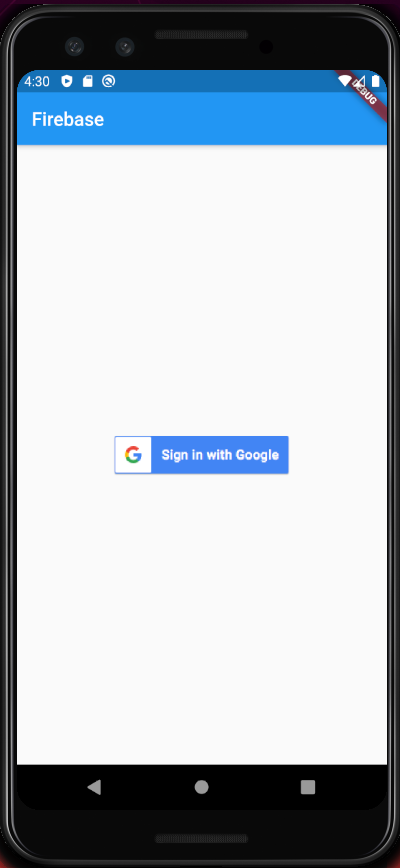

# Firebase Autentication and Firestore NoSql Database

### Dart Packages

- firebase authentication &nbsp;&nbsp;( google cloud firebase autentication service )<br />
    https://pub.dev/packages/firebase_auth
- google sign-in &nbsp;&nbsp;( authenticate user using google sign-in  )<br />
    https://pub.dev/packages/google_sign_in
- firestore nosql database &nbsp;&nbsp;( google cloud firestore database to store user information)<br />
    https://pub.dev/packages/cloud_firestore


### Features

```sh
Google sign-in using Google Cloud Firebase authentication service.
```

```sh
New user information is saved into Firestore after successsfully sign in through Google sign-in.
```

```sh
After old user successsfully sign in through Google sign-in using Firebase cloud authentication.
```
