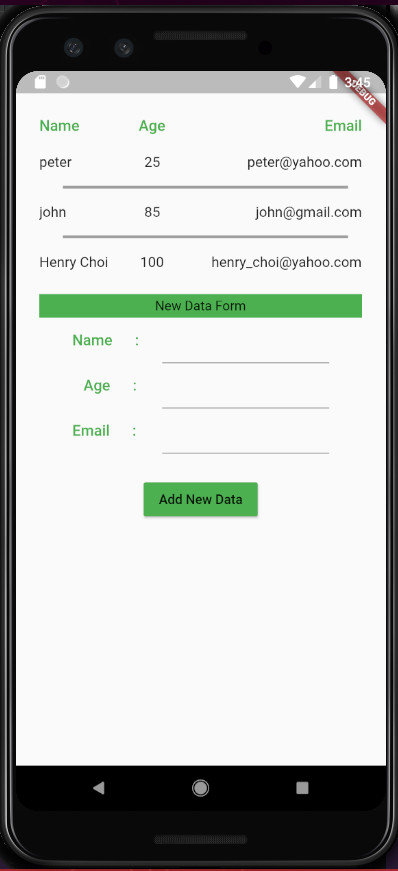
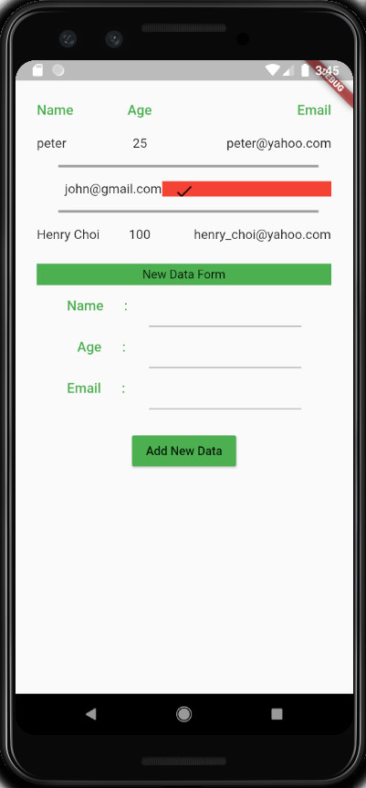
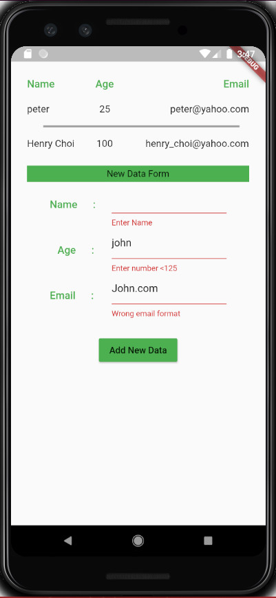

# Insulin Dose Calculator

### Dart Packages
- Flutter material design package <br />
    https://api.flutter.dev/flutter/material/material-library.html
- HTML flutter package <br />
    https://pub.dev/packages/html

### Link to the Web Version Of this App.
http://mdy123.github.io/flutter/google_sheets/web/#/
```sh
    - Swipe Swipe left or right to delete data
    - Form with data validations to input data
```
### Features

```sh
Pull the data from Google Sheet.
```

```sh
Swipe left or right to delete data.
```

```sh
Data Validation before sending to Google Sheet
    - Null data validation
    - Number data validation for age
    - Email format data validation for email
```

