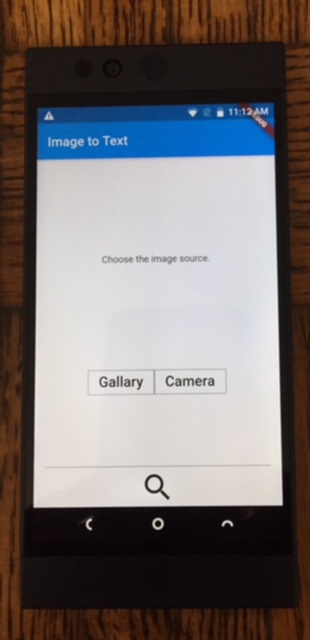
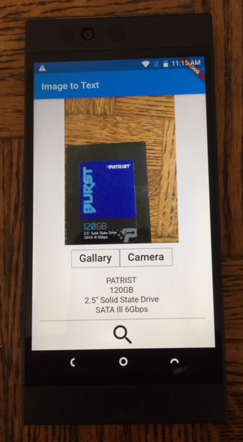
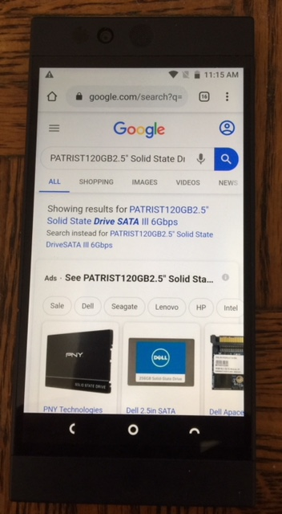

# Image to Text App

### Dart Packages

- firebase_ml_vision &nbsp;&nbsp;( convert the image to text )<br />
    https://pub.dev/packages/firebase_ml_vision
- image_picker &nbsp;&nbsp;( select the image from local storage or directly from camera )<br />
    https://pub.dev/packages/image_picker
- url_launcher &nbsp;&nbsp;( google search the text on the browser)<br />
    https://pub.dev/packages/url_launcher


### Features

```sh
Select the image from local storage or take the image directly from camera.
```

```sh
Convert the image to text using Google firebase_ml_vision package.
```

```sh
Google search the text translated from the image when pressed the search icon.
```
