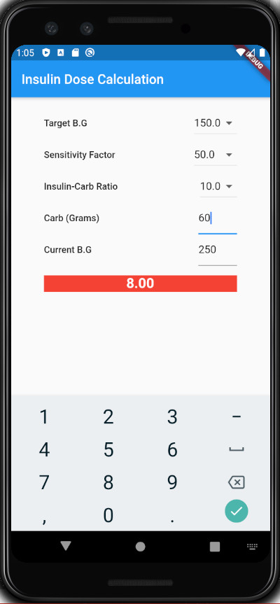
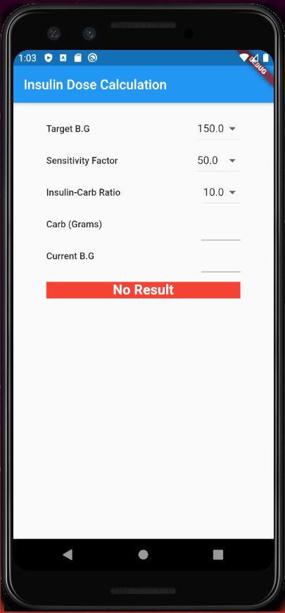

# Insulin Dose Calculator

### Dart Packages
- Flutter material design package <br />
    https://api.flutter.dev/flutter/material/material-library.html


### Features

```sh
Data Validating
- No zero value at Carb and Target G.B  data fileds.
- No character at Carb and Target G.B data fields.
```

```sh
Marker moves to the middle of map and shows the name when you touch it on the map.
```

