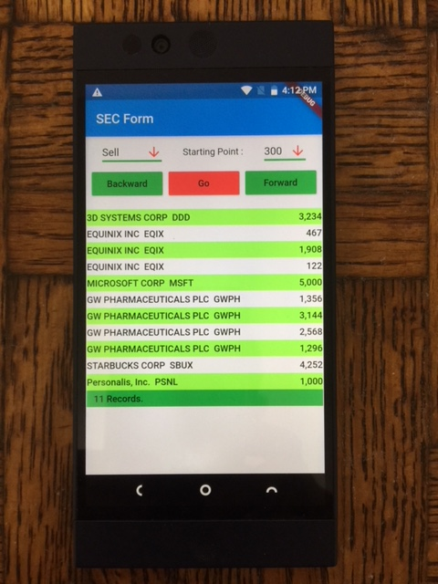

# Web Scraping App


### Dart Packages
- html &nbsp;&nbsp;(parsing html page)<br />
    https://pub.dev/packages/html
- webview_flutter &nbsp;&nbsp;(launch web page in the app)<br />
    https://pub.dev/packages/webview_flutter


### Features

```sh
Pull 100 records of data from web page each time. 
```

```sh
Show totally of Puchase or Sell amount and company name from each record
```

```sh
When select the item from the list, it opens new window with 
three tabs (yahoo,sec and google ) for more information about that company. 
```
